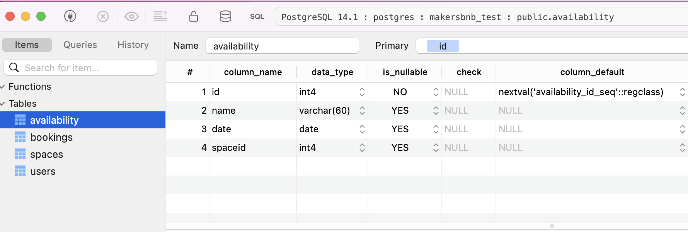
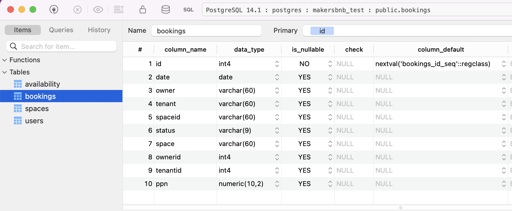
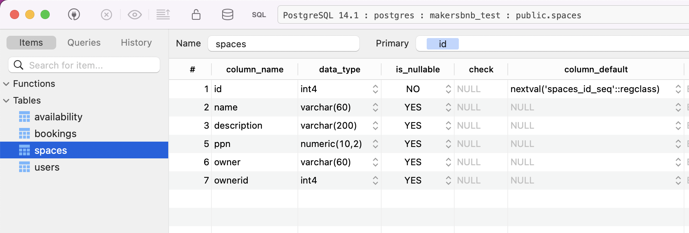
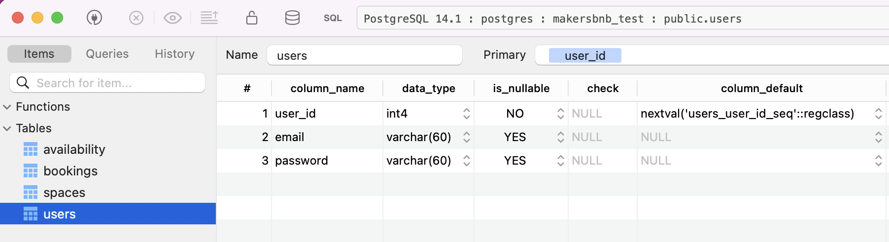

# MakersBnB

## Motivation
This project enables registered users to 
    (1) interact with a web interface to list properties on a databse;
    (2) request to rent properties for a night;
    (3) respond to requests made against their own properties

It is intended to satisfy the following user stories:
> As a customer and landlord,  
> So that I can use MakersBnb,  
> I want to sign up to the service.

> As a landlord,  
> So that I can let my property,  
> I'd like to list a new space.

> As a landlord,  
> So that I can let multiple properties,  
> I'd like to list multiple spaces.

> As a landlord,  
> So that MakersBnB users can rent my property,  
> I want to be able to add a name, short description and its price per night.

> As a landlord,  
> So MakersBnB can rent my property,  
> I want to be able to list its available dates.

> As a landlord,  
> So I don't accidentally let my property to thugs,  
> I want to be able approve bookings.

> As a landlord,  
> So that I can avoid double booking,  
> I want dates which have already been booked to be marked as unavailable.

> As a landlord,  
> So the thugs don't stop people booking my properties,  
> I want my spaces to be marked as available until I confirm any booking requests.

## Features
Users can sign up to MakersBnB by registering a unique e-mail address and password. Once registered, they can list their own spaces, thus making them available to rent, as well as request to book other users' spaces.  
Users can manage their booking requests through their account page.

## How to Use
1. Fork the repo on github, or clone it using the terminal command `git clone https://github.com/marcusventin/makersbnb`.
2. Run `bundle install` in the terminal to install the required gems.
3. Create the project databases:
   * Run `psql` in your terminal.
   * Run `CREATE DATABASE makersbnb` to create a new database.
     * Don't forget to create a test database too!
   * Run the queries saved in ./db/migrations/
     * Once setup is complete, your tables should look like the below when viewed in TablePlus:
    
    
    
    
4. To start the program, run `app ruby.rb` in the terminal and visit http://localhost:4567/makersbnb
    * Alternatively, run `rackup` and visit http://localhost:9292/makersbnb